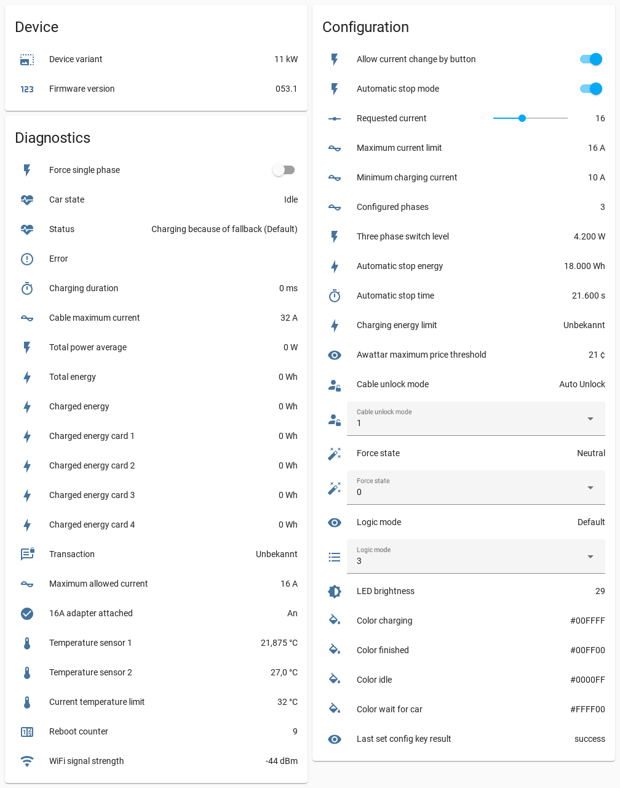

# homeassistant-goecharger-mqtt


[](https://www.buymeacoffee.com/syssi)

This is a custom component for Home Assistant to integrate the go-eCharger HOME+ and HOMEfix using the MQTT API (v2).



## Installation

Use HACS to install this custom component.

## Configuration

Use the Web UI (Config flow) to add the "go-eCharger" integration. You have to know the `serial number` (6 digits) of your device. Please don't forget to [enable the MQTT API (v2) via the go-e Charger app](https://github.com/goecharger/go-eCharger-API-v2/blob/main/mqtt-en.md) first.

## Entities

### Binary sensors

| Topic | Friendly name | Category | Enabled per default | Supported | Unsupported reason |
| ----- | ------------- | -------- | ------------------- | --------- | ------------------ |
| `car` | Car connected | `diagnostic` |  | :heavy_check_mark: | :heavy_check_mark: | |
| `pha` | Phase L1 after contactor | `diagnostic` | :white_large_square: | :heavy_check_mark: | |
| `pha` | Phase L2 after contactor | `diagnostic` | :white_large_square: | :heavy_check_mark: | |
| `pha` | Phase L3 after contactor | `diagnostic` | :white_large_square: | :heavy_check_mark: | |
| `pha` | Phase L1 before contactor | `diagnostic` | :white_large_square: | :heavy_check_mark: | |
| `pha` | Phase L2 before contactor | `diagnostic` | :white_large_square: | :heavy_check_mark: | |
| `pha` | Phase L3 before contactor | `diagnostic` | :white_large_square: | :heavy_check_mark: | |
| `cca` | Cloud websocket use client auth | `config` | :white_large_square: | :white_large_square: | [^1] |
| `ocuca` | OTA cloud use client auth | `config` | :white_large_square: | :white_large_square: | [^1] |
| `sbe` | Secure boot enabled |  | :white_large_square: | :white_large_square: | [^1] |
| `adi` | 16A adapter attached | `diagnostic` | :heavy_check_mark: | :heavy_check_mark: | |
| `cpe` | Charge control requests the cp signal enabled or not immediately | `diagnostic` | :white_large_square: | :white_large_square: | [^1] |
| `cpr` | CP enable request | `diagnostic` | :white_large_square: | :white_large_square: | [^1] |
| `cws` | Cloud websocket started | `diagnostic` | :white_large_square: | :white_large_square: | [^1] |
| `cwsc` | Cloud websocket connected | `diagnostic` | :white_large_square: | :white_large_square: | [^1] |
| `fsp` | Force single phase | `diagnostic` | :heavy_check_mark: | :heavy_check_mark: | Is always false. Please use `psm` instead |
| `lwcf` | Last failed WiFi connect | `diagnostic` | :white_large_square: | :white_large_square: | [^1] |
| `tlf` | Test charging finished | `diagnostic` | :white_large_square: | :white_large_square: | [^1] |
| `tls` | Test charging started | `diagnostic` | :white_large_square: | :white_large_square: | [^1] |
| `sua` | Simulate unplugging permanently | `config` | :white_large_square: | :white_large_square: | [^1] |

### Buttons

| Topic | Friendly name | Category | Enabled per default | Supported | Unsupported reason |
| ----- | ------------- | -------- | ------------------- | --------- | ------------------ |
| `rst` | Restart device | `config` | :heavy_check_mark:  | :heavy_check_mark: | |
| `frc` | Force state neutral | `config` | :white_large_square: | :heavy_check_mark: | |
| `frc` | Force state dont charge | `config` | :white_large_square: | :heavy_check_mark: | |
| `frc` | Force state charge | `config` | :white_large_square: | :heavy_check_mark: | |

### Sensors

| Key | Friendly name | Category | Unit | Enabled per default | Supported | Unsupported reason |
| --- | ------------- | -------- | ---- | ------------------- | --------- | ------------------ |
| `+/result` | Last set config key result | `config` |  | :heavy_check_mark: | :heavy_check_mark: | |
| `ama` | Maximum current limit | `config` | A | :heavy_check_mark: | :heavy_check_mark: | |
| `ate` | Automatic stop energy | `config` | Wh | :heavy_check_mark: | :heavy_check_mark: | |
| `att` | Automatic stop time | `config` | s | :heavy_check_mark: | :heavy_check_mark: | |
| `awc` | Awattar country | `config` |  | :white_large_square: | :white_large_square: | [^1] |
| `awp` | Awattar maximum price threshold | `config` | ¢ | :white_large_square: | :heavy_check_mark: | |
| `cch` | Color charging | `config` |  | :white_large_square: | :heavy_check_mark: | |
| `cco` | Car consumption | `config` |  | :white_large_square: | :white_large_square: | App only |
| `cfi` | Color finished | `config` |  | :white_large_square: | :heavy_check_mark: | |
| `cid` | Color idle | `config` |  | :white_large_square: | :heavy_check_mark: | |
| `clp` | Current limit presets | `config` | A | :white_large_square: | :heavy_check_mark: | |
| `ct` | Car type | `config` |  | :white_large_square: | :white_large_square: | App only |
| `cwc` | Color wait for car | `config` |  | :white_large_square: | :heavy_check_mark: | |
| `dwo` | Charging energy limit | `config` | Wh | :heavy_check_mark: | :heavy_check_mark: | |
| `fna` | Friendly name | `config` |  | :white_large_square: | :white_large_square: | [^1] |
| `frc` | Force state | `config` |  | :heavy_check_mark: | :heavy_check_mark: | |
| `frc` | Force state code | `config` |  | :white_large_square: | :heavy_check_mark: | |
| `lbr` | LED brightness | `config` |  | :white_large_square: | :heavy_check_mark: | |
| `lmo` | Logic mode | `config` |  | :heavy_check_mark: | :heavy_check_mark: | |
| `lof` | Load balancing fallback current | `config` | A | :white_large_square: | :white_large_square: | [^1] |
| `log` | Load balancing group id | `config` |  | :white_large_square: | :white_large_square: | [^1] |
| `lop` | Load balancing priority | `config` |  | :white_large_square: | :white_large_square: | [^1] |
| `lot` | Load balancing total ampere | `config` | A | :white_large_square: | :white_large_square: | [^1] |
| `loty` | Load balancing type | `config` |  | :white_large_square: | :white_large_square: | [^1] |
| `map` | Load mapping | `config` |  | :white_large_square: | :white_large_square: | [^1] |
| `mca` | Minimum charging current | `config` | A | :heavy_check_mark: | :heavy_check_mark: | |
| `mci` | Minimum charging interval | `config` | ms | :white_large_square: | :white_large_square: | [^1] |
| `mcpd` | Minimum charge pause duration | `config` | ms | :white_large_square: | :white_large_square: | [^1] |
| `mptwt` | Minimum phase toggle wait time | `config` | ms | :white_large_square: | :white_large_square: | [^1] |
| `mpwst` | Minimum phase wish switch time | `config` | ms | :white_large_square: | :white_large_square: | [^1] |
| `pass` | User password | `config` |  | :white_large_square: | :white_large_square: | [^1] |
| `psmd` | Force single phase duration | `config` | ms | :white_large_square: | :white_large_square: | [^1] |
| `sch_satur` | Scheduler saturday | `config` |  | :white_large_square: | :white_large_square: | [^1] |
| `sch_sund` | Scheduler sunday | `config` |  | :white_large_square: | :white_large_square: | [^1] |
| `sch_week` | Scheduler weekday | `config` |  | :white_large_square: | :white_large_square: | [^1] |
| `spl3` | Three phase switch level | `config` | W | :heavy_check_mark: | :heavy_check_mark: | |
| `sumd` | Simulate unplugging duration | `config` | ms | :white_large_square: | :white_large_square: | [^1] |
| `tds` | Timezone daylight saving mode | `config` |  | :white_large_square: | :white_large_square: | [^1] |
| `tof` | Timezone offset in minutes | `config` |  | :white_large_square: | :white_large_square: | [^1] |
| `ts` | Time server | `config` |  | :white_large_square: | :white_large_square: | [^1] |
| `tssi` | Time server sync interval | `config` |  | :white_large_square: | :white_large_square: | [^1] |
| `tssm` | Time server sync mode | `config` |  | :white_large_square: | :white_large_square: | [^1] |
| `tsss` | Time server sync status | `config` |  | :white_large_square: | :white_large_square: | [^1] |
| `ust` | Cable unlock mode | `config` |  | :heavy_check_mark: | :heavy_check_mark: | |
| `ust` | Cable unlock mode code | `config` |  | :white_large_square: | :heavy_check_mark: | |
| `wak` | WiFi accesspoint encryption key | `config` |  | :white_large_square: | :white_large_square: | [^1] |
| `wan` | WiFi accesspoint network name | `config` |  | :white_large_square: | :white_large_square: | [^1] |
| `wifis` | WiFi configurations | `config` |  | :white_large_square: | :white_large_square: | [^1] |
| `apd` | Firmware description |  |  | :white_large_square: | :white_large_square: | [^1] |
| `arv` | App recommended version |  |  | :white_large_square: | :white_large_square: | [^1] |
| `ecf` | ESP CPU frequency |  |  | :white_large_square: | :white_large_square: | [^1] |
| `eci` | ESP Chip info |  |  | :white_large_square: | :white_large_square: | [^1] |
| `eem` | ESP CPU frequency |  |  | :white_large_square: | :white_large_square: | [^1] |
| `efi` | ESP Flash info |  |  | :white_large_square: | :white_large_square: | [^1] |
| `facwak` | WiFi accesspoint key reset value |  |  | :white_large_square: | :white_large_square: | [^1] |
| `fem` | Flash encryption mode |  |  | :white_large_square: | :white_large_square: | [^1] |
| `ffna` | Factory friendly name |  |  | :white_large_square: | :white_large_square: | [^1] |
| `fwan` | Factory WiFi accesspoint network name |  |  | :white_large_square: | :white_large_square: | [^1] |
| `fwc` | Firmware from car control |  |  | :white_large_square: | :white_large_square: | [^1] |
| `fwv` | Firmware version |  |  | :white_large_square: | :heavy_check_mark: | |
| `mod` | Hardware version |  |  | :white_large_square: | :white_large_square: | [^1] |
| `oem` | Manufacturer |  |  | :white_large_square: | :white_large_square: | [^1] |
| `otap` | Active OTA partition |  |  | :white_large_square: | :white_large_square: | [^1] |
| `part` | Partition table |  |  | :white_large_square: | :white_large_square: | [^1] |
| `pto` | Partition table offset in flash |  |  | :white_large_square: | :white_large_square: | [^1] |
| `sse` | Serial number |  |  | :white_large_square: | :white_large_square: | [^1] |
| `typ` | Device type |  |  | :white_large_square: | :white_large_square: | [^1] |
| `var` | Device variant |  | kW | :white_large_square: | :heavy_check_mark: | |
| `del` | Delete card | `config` |  | :white_large_square: | :white_large_square: | [^1] |
| `delw` | Delete STA config | `config` |  | :white_large_square: | :white_large_square: | [^1] |
| `lrn` | Learn card | `config` |  | :white_large_square: | :white_large_square: | [^1] |
| `oct` | Firmware update trigger | `config` |  | :white_large_square: | :white_large_square: | [^1] |
| `acu` | Maximum allowed current | `diagnostic` | A | :heavy_check_mark: | :heavy_check_mark: | |
| `amt` | Current temperature limit | `diagnostic` | °C | :heavy_check_mark: | :heavy_check_mark: | |
| `atp` | Next trip plan data | `diagnostic` |  | :white_large_square: | :white_large_square: | [^1] |
| `awcp` | Awattar current price | `diagnostic` |  | :white_large_square: | :heavy_check_mark: | |
| `awpl` | Awattar price list | `diagnostic` |  | :white_large_square: | :white_large_square: | [^1] |
| `car` | Car state | `diagnostic` |  | :heavy_check_mark: | :heavy_check_mark: | |
| `cbl` | Cable maximum current | `diagnostic` | A | :white_large_square: | :heavy_check_mark: | |
| `ccu` | Charge controller update progress | `diagnostic` |  | :white_large_square: | :white_large_square: | [^1] |
| `ccw` | Connected WiFi | `diagnostic` |  | :white_large_square: | :white_large_square: | JSON decoding required. Values non-essential |
| `cdi` | Charging duration | `diagnostic` | ms | :heavy_check_mark: | :heavy_check_mark: | |
| `cdi` | Charging duration counter | `diagnostic` |  | :white_large_square: | :heavy_check_mark: | |
| `cus` | Cable unlock status code | `diagnostic` |  | :white_large_square: | :heavy_check_mark: | |
| `cus` | Cable unlock status | `diagnostic` |  | :heavy_check_mark: | :heavy_check_mark: | |
| `cwsca` | Cloud websocket connected | `diagnostic` | ms | :white_large_square: | :white_large_square: | [^1] |
| `efh` | ESP free heap | `diagnostic` |  | :white_large_square: | :white_large_square: | [^1] |
| `efh32` | ESP free heap 32bit aligned | `diagnostic` |  | :white_large_square: | :white_large_square: | [^1] |
| `efh8` | ESP free heap 8bit aligned | `diagnostic` |  | :white_large_square: | :white_large_square: | [^1] |
| `ehs` | ESP heap size | `diagnostic` |  | :white_large_square: | :white_large_square: | [^1] |
| `emfh` | ESP minimum free heap since boot | `diagnostic` |  | :white_large_square: | :white_large_square: | [^1] |
| `emhb` | ESP maximum size of allocated heap block since boot | `diagnostic` |  | :white_large_square: | :white_large_square: | [^1] |
| `err` | Error | `diagnostic` |  | :heavy_check_mark: | :heavy_check_mark: | |
| `err` | Error code | `diagnostic` |  | :white_large_square: | :heavy_check_mark: | |
| `esr` | RTC reset reason | `diagnostic` |  | :white_large_square: | :white_large_square: | [^1] |
| `eto` | Total energy | `diagnostic` | Wh | :heavy_check_mark: | :heavy_check_mark: | |
| `etop` | Total energy persisted | `diagnostic` | Wh | :white_large_square: | :white_large_square: | [^1] |
| `ffb` | Lock feedback | `diagnostic` |  | :white_large_square: | :white_large_square: | [^1] |
| `ffba` | Lock feedback age | `diagnostic` | ms | :white_large_square: | :white_large_square: | [^1] |
| `fhz` | Grid frequency | `diagnostic` | Hz | :white_large_square: | :heavy_check_mark: | |
| `fsptws` | Force single phase toggle wished since | `diagnostic` | ms | :white_large_square: | :white_large_square: | [^1] |
| `host` | Hostname on STA interface | `diagnostic` |  | :white_large_square: | :white_large_square: | [^1] |
| `lbp` | Last button press | `diagnostic` |  | :white_large_square: | :heavy_check_mark: | |
| `lccfc` | Last car state changed from charging | `diagnostic` | ms | :heavy_check_mark: | :heavy_check_mark: | |
| `lccfi` | Last car state changed from idle | `diagnostic` | ms | :heavy_check_mark: | :heavy_check_mark: | |
| `lcctc` | Last car state changed to charging | `diagnostic` | ms | :heavy_check_mark: | :heavy_check_mark: | |
| `lck` | Effective lock setting | `diagnostic` |  | :white_large_square: | :white_large_square: | [^1] |
| `led` | LED animation details | `diagnostic` |  | :white_large_square: | :white_large_square: | [^1] |
| `lfspt` | Last force single phase toggle | `diagnostic` | ms | :white_large_square: | :white_large_square: | [^1] |
| `lmsc` | Last model status change | `diagnostic` | ms | :white_large_square: | :heavy_check_mark: | |
| `loa` | Load balancing available current | `diagnostic` | A | :heavy_check_mark: | :heavy_check_mark: | |
| `loc` | Local time | `diagnostic` |  | :white_large_square: | :white_large_square: | Valueless with a high update interval of 1s |
| `lom` | Load balancing members | `diagnostic` |  | :white_large_square: | :white_large_square: | [^1] |
| `los` | Load balancing status | `diagnostic` |  | :white_large_square: | :white_large_square: | [^1] |
| `lssfc` | WiFi station disconnected since | `diagnostic` |  | :white_large_square: | :white_large_square: | [^1] |
| `lsstc` | WiFi station connected since | `diagnostic` |  | :white_large_square: | :white_large_square: | [^1] |
| `mcpea` | Minimum charge pause ends at | `diagnostic` | ms | :white_large_square: | :white_large_square: | [^1] |
| `mmp` | Maximum measured charging power | `diagnostic` | W | :white_large_square: | :white_large_square: | [^1] |
| `modelStatus` | Status | `diagnostic` |  | :heavy_check_mark: | :heavy_check_mark: | |
| `modelStatus` | Status code | `diagnostic` |  | :white_large_square: | :heavy_check_mark: | |
| `msi` | Reason why we allow charging or not | `diagnostic` |  | :white_large_square: | :white_large_square: | [^1] |
| `nrg` | Voltage L1 | `diagnostic` | V | :heavy_check_mark: | :heavy_check_mark: | |
| `nrg` | Voltage L2 | `diagnostic` | V | :heavy_check_mark: | :heavy_check_mark: | |
| `nrg` | Voltage L3 | `diagnostic` | V | :heavy_check_mark: | :heavy_check_mark: | |
| `nrg` | Voltage N | `diagnostic` | V | :heavy_check_mark: | :heavy_check_mark: | |
| `nrg` | Current L1 | `diagnostic` | A | :heavy_check_mark: | :heavy_check_mark: | |
| `nrg` | Current L2 | `diagnostic` | A | :heavy_check_mark: | :heavy_check_mark: | |
| `nrg` | Current L3 | `diagnostic` | A | :heavy_check_mark: | :heavy_check_mark: | |
| `nrg` | Power L1 | `diagnostic` | W | :heavy_check_mark: | :heavy_check_mark: | |
| `nrg` | Power L2 | `diagnostic` | W | :heavy_check_mark: | :heavy_check_mark: | |
| `nrg` | Power L3 | `diagnostic` | W | :heavy_check_mark: | :heavy_check_mark: | |
| `nrg` | Power N | `diagnostic` | W | :heavy_check_mark: | :heavy_check_mark: | |
| `nrg` | Current power | `diagnostic` | W | :heavy_check_mark: | :heavy_check_mark: | |
| `nrg` | Power factor L1 | `diagnostic` | % | :heavy_check_mark: | :heavy_check_mark: | |
| `nrg` | Power factor L2 | `diagnostic` | % | :heavy_check_mark: | :heavy_check_mark: | |
| `nrg` | Power factor L3 | `diagnostic` | % | :heavy_check_mark: | :heavy_check_mark: | |
| `nrg` | Power factor N | `diagnostic` | % | :heavy_check_mark: | :heavy_check_mark: | |
| `oca` | OTA cloud app description | `diagnostic` |  | :white_large_square: | :white_large_square: | [^1] |
| `ocl` | OTA from cloud length | `diagnostic` |  | :white_large_square: | :white_large_square: | [^1] |
| `ocm` | OTA from cloud message | `diagnostic` |  | :white_large_square: | :white_large_square: | [^1] |
| `ocp` | OTA from cloud progress | `diagnostic` |  | :white_large_square: | :white_large_square: | [^1] |
| `ocs` | OTA from cloud status | `diagnostic` |  | :white_large_square: | :white_large_square: | [^1] |
| `ocu` | List of available firmware versions | `diagnostic` |  | :white_large_square: | :heavy_check_mark: | |
| `onv` | Newest OTA version | `diagnostic` |  | :white_large_square: | :white_large_square: | [^1] |
| `pwm` | Phase wish mode for debugging | `diagnostic` |  | :white_large_square: | :white_large_square: | [^1] |
| `pgrid` | Power from Grid |  |  | :heavy_check_mark: | :heavy_check_mark: | |
| `ppv` | Power from Solar Panels |  |  | :heavy_check_mark: | :heavy_check_mark: | |
| `pakku` | Power from External Battery |  |  | :heavy_check_mark: | :heavy_check_mark: | |
| `qsc` | Queue size cloud | `diagnostic` |  | :white_large_square: | :white_large_square: | [^1] |
| `qsw` | Queue size web | `diagnostic` |  | :white_large_square: | :white_large_square: | [^1] |
| `rbc` | Reboot counter | `diagnostic` |  | :heavy_check_mark: | :heavy_check_mark: | |
| `rbt` | Uptime | `diagnostic` |  | :white_large_square: | :white_large_square: | TODO: Convert to a timestamp first |
| `rcd` | Residual current detection | `diagnostic` |  | :white_large_square: | :white_large_square: | [^1] |
| `rfb` | Relay feedback | `diagnostic` |  | :white_large_square: | :white_large_square: | [^1] |
| `rr` | ESP reset reason | `diagnostic` |  | :white_large_square: | :white_large_square: | [^1] |
| `rssi` | WiFi signal strength | `diagnostic` | dBm | :white_large_square: | :heavy_check_mark: | |
| `scaa` | WiFi scan age | `diagnostic` |  | :white_large_square: | :white_large_square: | [^1] |
| `scan` | WiFi scan result | `diagnostic` |  | :white_large_square: | :white_large_square: | [^1] |
| `scas` | WiFi scan status | `diagnostic` |  | :white_large_square: | :white_large_square: | [^1] |
| `tma` | Temperature sensor 1 | `diagnostic` | °C | :heavy_check_mark: | :heavy_check_mark: | |
| `tma` | Temperature sensor 2 | `diagnostic` | °C | :heavy_check_mark: | :heavy_check_mark: | |
| `tpa` | Total power average | `diagnostic` | W | :heavy_check_mark: | :heavy_check_mark: | |
| `trx` | Transaction | `diagnostic` |  | :heavy_check_mark: | :heavy_check_mark: | |
| `tsom` | Time server operating mode | `diagnostic` |  | :white_large_square: | :white_large_square: | [^1] |
| `utc` | UTC time | `diagnostic` |  | :white_large_square: | :white_large_square: | Valueless with a high update interval of 1s |
| `wcch` | Clients via http | `diagnostic` |  | :white_large_square: | :white_large_square: | [^1] |
| `wccw` | Clients via websocket | `diagnostic` |  | :white_large_square: | :white_large_square: | [^1] |
| `wh` | Charged energy | `diagnostic` | Wh | :heavy_check_mark: | :heavy_check_mark: | |
| `wsms` | WiFi state machine state | `diagnostic` |  | :white_large_square: | :white_large_square: | [^1] |
| `wst` | WiFi station status | `diagnostic` |  | :white_large_square: | :white_large_square: | [^1] |
| `psm` | Configured phases | `config` |  | :heavy_check_mark: | :heavy_check_mark: | |
| `cards` | Charged energy card 1 | `diagnostic` | Wh | :heavy_check_mark: | :heavy_check_mark: | |
| `cards` | Charged energy card 2 | `diagnostic` | Wh | :white_large_square: | :heavy_check_mark: | |
| `cards` | Charged energy card 3 | `diagnostic` | Wh | :white_large_square: | :heavy_check_mark: | |
| `cards` | Charged energy card 4 | `diagnostic` | Wh | :white_large_square: | :heavy_check_mark: | |
| `cards` | Charged energy card 5 | `diagnostic` | Wh | :white_large_square: | :heavy_check_mark: | |
| `cards` | Charged energy card 6 | `diagnostic` | Wh | :white_large_square: | :heavy_check_mark: | |
| `cards` | Charged energy card 7 | `diagnostic` | Wh | :white_large_square: | :heavy_check_mark: | |
| `cards` | Charged energy card 8 | `diagnostic` | Wh | :white_large_square: | :heavy_check_mark: | |
| `cards` | Charged energy card 9 | `diagnostic` | Wh | :white_large_square: | :heavy_check_mark: | |
| `cards` | Charged energy card 10 | `diagnostic` | Wh | :white_large_square: | :heavy_check_mark: | |

### Switch entities

| Key | Friendly name | Category | Enabled per default | Supported | Unsupported reason |
| --- | ------------- | -------- | ------------------- | --------- | ------------------ |
| `bac` | Allow current change by button | `config` | :heavy_check_mark: | :heavy_check_mark: | |
| `ara` | Automatic stop mode | `config` | :heavy_check_mark: | :heavy_check_mark: | |
| `wen` | WiFi enabled | `config` | :white_large_square: | :white_large_square: | [^1] |
| `tse` | Time server enabled | `config` | :white_large_square: | :white_large_square: | [^1] |
| `sdp` | Button allow force change | `config` | :white_large_square: | :white_large_square: | [^1] |
| `nmo` | Norway mode | `config` | :white_large_square: | :white_large_square: | [^1] |
| `lse` | LED off on standby | `config` | :white_large_square: | :white_large_square: | [^1] |
| `awe` | Awattar mode | `config` | :heavy_check_mark: | :white_large_square: | [^1] |
| `acp` | Allow charge pause | `config` | :heavy_check_mark: | :white_large_square: | [^1] |
| `esk` | Energy set | `config` | :white_large_square: | :white_large_square: | App only |
| `fup` | Charge with PV surplus | `config` | :heavy_check_mark: | :heavy_check_mark: | |
| `su` | Simulate unplugging | `config` | :white_large_square: | :white_large_square: | [^1] |
| `hws` | HTTP STA reachable | `config` | :white_large_square: | :white_large_square: | [^1] |
| `hsa` | HTTP STA authentication | `config` | :white_large_square: | :white_large_square: | [^1] |
| `loe` | Load balancing enabled | `config` | :white_large_square: | :white_large_square: | [^1] |
| `upo` | Unlock power outage | `config` | :white_large_square: | :white_large_square: | [^1] |
| `cwe` | Cloud websocket enabled | `config` | :white_large_square: | :white_large_square: | [^1] |
| `psm` | Force single phase | `diagnostic` | :heavy_check_mark: | :heavy_check_mark: | |
| `acs` | Card authorization required | `config` | :heavy_check_mark: | :heavy_check_mark: | |

### Number entities

| Key | Friendly name | Category | Enabled per default | Supported | Unsupported reason |
| --- | ------------- | -------- | ------------------- | --------- | ------------------ |
| `ama` | Maximum current limit | `config` | A | :heavy_check_mark: | :heavy_check_mark: | |
| `amp` | Requested current | `config` | :heavy_check_mark: | :heavy_check_mark: | |
| `ate` | Automatic stop energy | `config` | :heavy_check_mark: | :heavy_check_mark: | |
| `att` | Automatic stop time | `config` | :heavy_check_mark: | :heavy_check_mark: | |

### Select entities

| Key | Friendly name | Category | Enabled per default | Supported | Unsupported reason |
| --- | ------------- | -------- | ------------------- | --------- | ------------------ |
| `lmo` | Logic mode | `config` | :heavy_check_mark: | :heavy_check_mark: | |
| `ust` | Cable unlock mode | `config` | :heavy_check_mark: | :heavy_check_mark: | |
| `frc` | Force state | `config` | :heavy_check_mark: | :heavy_check_mark: | |
| `trx` | Transaction | `config` | :heavy_check_mark: | :heavy_check_mark: | |

## Charge with PV Surplus

### Setable only PV-surplus entities

This feature requires firmware 0.55 or newer.

| Key | Friendly name | Category | Enabled per default | Supported | Unsupported reason |
| --- | ------------- | -------- | ------------------- | --------- | ------------------ |
| `ids` | Input avail Power | `config` | :white_large_square:  | :heavy_check_mark:  | |

`ids` is used to input values to the ECO PV-surplus charging mode. (PV = Photo Voltaic aka Solar Panels)

`ids` is set with a JSON list: `{"pGrid":0.0,"pAkku":0.0,"pPv":0.0}` - If values are accepted they can be read back thru the `pgrid`, `pakku` and `ppv` sensors. `pGrid` is required. The others are optional.

`ids` values decays, so must be updated every 10s or faster. No update for 10-15s means no PV-surplus is available. `pgrid`/`pakku`/`ppv` will thus all become `unknown`.

Only `pGrid` is used in calculations. Negative `pGrid` means power is exported, and thus available to the charger. Charger is then constantly calculating available power and adjusting charge power up and down multiple times per minute (on every update). If 1/3 phase is set to automatic, it will switch between 1 and 3 phases. The 1->3 phase switch level is set in `spl3`

By feeding `ids` values, ECO charging can be controlled (on/off) in the go-eCharger App. It is safe and expected to set this value often.

For PV surplus charging to be enabled, `lmo` (Logic mode) most be set to 4 (Eco mode), and `fup` (Use PV surplus) must be set to true.

See template example below for how to continuously update `ids`

#### Automation example
```
alias: go-e Surplus Charging
description: "Simple automation to update values needed for using solar surplus with go-e Chargers"
trigger:
  - platform: time_pattern
    seconds: /5
condition: []
action:
  - service: mqtt.publish
    data:
      qos: "0"
      # Change to your charger ID here
      topic: go-eCharger/999999/ids/set
      # Please provide your own entities here, as described above
      payload: {{'{"pGrid": '}}{{states('sensor.meter_active_power_raw')}}{{', "pPv":'}}{{states('sensor.total_dc_power')}}{{', "pAkku":0}'}}
      retain: false
```

## Platform services

### Service `goecharger_mqtt.set_config_key`

Sets a config `key` to a `value`.

| Service data attribute    | Optional | Description                                                          |
|---------------------------|----------|----------------------------------------------------------------------|
| `serial_number`           |       no | The serial number of the go-e device                                 |
| `key`                     |       no | The key of the config parameter you want to change                   |
| `value`                   |       no | The new value                                                        |

## Tips and tricks

### How to suspend the access point of the go-e charger

Per default the WiFi network of the charger is always active even if the device is connected as station to your
WiFi network. If `cloud access` is enabled the API key `wda` can be used to suspend the access point as soon
as the connection to the cloud is established:

```
# Suspend access point mode on cloud connection
curl -s "http://192.168.xx.xx/api/set?wda=true"

# Pretty print the full status
curl -s "http://192.168.xx.xx/api/status" | json_pp

# Check the value of the `wda` key
curl -s "http://192.168.1.11/api/status" | jq '.wda'
```

The `wda` key can be changed via the HTTP-API v2 only. The device doesn't accept the setting via MQTT. For more
details please see https://github.com/goecharger/go-eCharger-API-v2/issues/35.

## References

* https://github.com/goecharger/go-eCharger-API-v2/blob/main/mqtt-en.md
* https://github.com/goecharger/go-eCharger-API-v2/blob/main/apikeys-en.md
* https://github.com/boralyl/github-custom-component-tutorial

[^1]: Not exposed via MQTT in firmware 053.1
